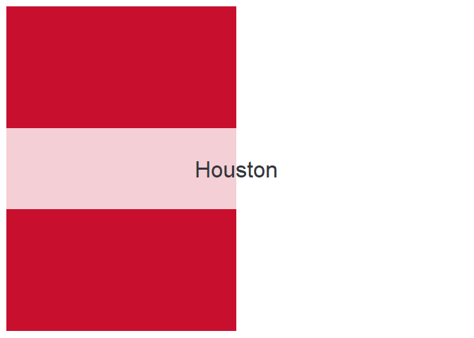
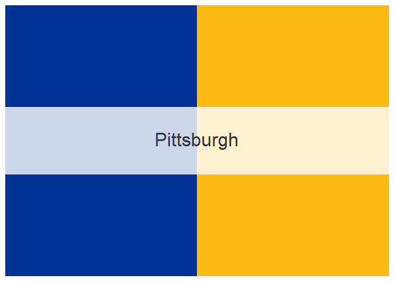
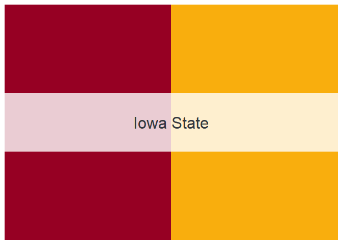
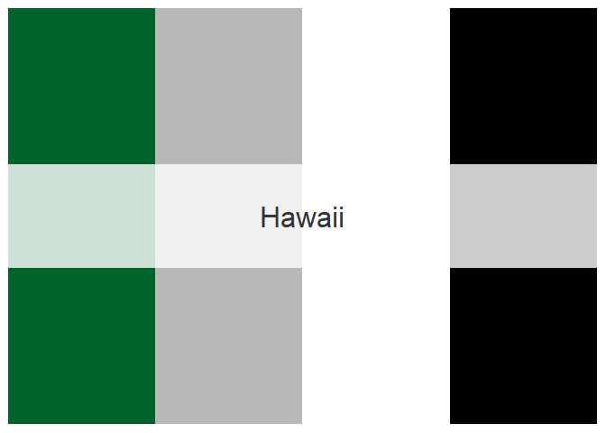

<!-- README.md is generated from README.Rmd. Please edit that file -->

# cfbcolors

<!-- badges: start -->
<!-- badges: end -->

The goal of cfbcolors is to easily generate NCAA football team color
palettes.

## Installation

You can install the released version of cfbcolors from
[GitHub](https://github.com/) with:

``` r
# install.packages("devtools")
devtools::install_github("corysauve/cfbcolors")
```

## Basic Usage

cfbcolors has palettes for … teams in NCAA college football. Colors are
sourced from primary uniforms and logos. Note that if white is not one
of the two primary colors, it is omitted in the palette. All teams are
accessed via their school name.

``` r
library(cfbcolors)

names(teams)
#>   [1] "Cincinnati"            "East Carolina"         "Houston"              
#>   [4] "Memphis"               "Navy"                  "SMU"                  
#>   [7] "South Florida"         "Temple"                "Tulane"               
#>  [10] "Tulsa"                 "UCF"                   "Boston College"       
#>  [13] "Clemson"               "Duke"                  "Florida State"        
#>  [16] "Georgia Tech"          "Louisville"            "Miami"                
#>  [19] "NC State"              "North Carolina"        "Notre Dame"           
#>  [22] "Pittsburgh"            "Syracuse"              "Virginia"             
#>  [25] "Virginia Tech"         "Wake Forest"           "Baylor"               
#>  [28] "Iowa State"            "Kansas"                "Kansas State"         
#>  [31] "Oklahoma"              "Oklahoma State"        "TCU"                  
#>  [34] "Texas"                 "Texas Tech"            "West Virginia"        
#>  [37] "Illinois"              "Indiana"               "Iowa"                 
#>  [40] "Maryland"              "Michigan State"        "Michigan"             
#>  [43] "Minnesota"             "Nebraska"              "Northwestern"         
#>  [46] "Ohio State"            "Penn State"            "Purdue"               
#>  [49] "Rutgers"               "Wisconsin"             "Charlotte"            
#>  [52] "Florida Atlantic"      "Florida International" "Louisiana Tech"       
#>  [55] "Marshall"              "Middle Tennessee"      "North Texas"          
#>  [58] "Old Dominion"          "Rice"                  "Southern Mississippi" 
#>  [61] "UAB"                   "UTEP"                  "UTSA"                 
#>  [64] "Western Kentucky"      "Army"                  "BYU"                  
#>  [67] "Liberty"               "New Mexico State"      "UConn"                
#>  [70] "UMass"                 "Akron"                 "Ball State"           
#>  [73] "Bowling Green"         "Buffalo"               "Central Michigan"     
#>  [76] "Eastern Michigan"      "Kent State"            "Miami (OH)"           
#>  [79] "Northern Illinois"     "Ohio"                  "Toledo"               
#>  [82] "Western Michigan"      "Air Force"             "Boise State"          
#>  [85] "Colorado State"        "Fresno State"          "Hawaii"               
#>  [88] "Nevada"                "New Mexico"            "San Diego State"      
#>  [91] "San Jose State"        "UNLV"                  "Utah State"           
#>  [94] "Wyoming"               "Arizona State"         "Arizona"              
#>  [97] "California"            "Colorado"              "Oregon"               
#> [100] "Oregon State"          "Stanford"              "UCLA"                 
#> [103] "USC"                   "Utah"                  "Washington"           
#> [106] "Washington State"      "Alabama"               "Arkansas"             
#> [109] "Auburn"                "Florida"               "Georgia"              
#> [112] "Kentucky"              "LSU"                   "Mississippi State"    
#> [115] "Missouri"              "Ole Miss"              "South Carolina"       
#> [118] "Tennessee"             "Texas A&M"             "Vanderbilt"           
#> [121] "Appalachian State"     "Arkansas State"        "Coastal Carolina"     
#> [124] "Georgia Southern"      "Georgia State"         "Louisiana"            
#> [127] "South Alabama"         "Texas State"           "Troy"                 
#> [130] "UL Monroe"
```

You can create a team palette with `team_colors()`, along with an image
of the palette.

``` r
psu_palette <- team_colors("Penn State")
```

You can also select a specific number of colors.

``` r
iu_palette <- team_colors("Indiana", 2)
```

## Available Team Palettes

-   [**American Conference**](#American-Conference)
-   [**ACC**](#ACC)
-   [**Big 12**](#Big-12)
-   [**B1G Conference**](#B1G-Conference)
-   [**Conference USA**](#Conference-USA)
-   [**FBS-Independents**](#FBS-Independents)
-   [**Mid-American**](#Mid-American)
-   [**Mountain West**](#Mountain-West)
-   [**Pac-12**](#Pac-12)
-   [**SEC**](#SEC)
-   [**Sunbelt**](#Sun-Belt)

<br>

### American Conference



<br>

### ACC



<br>

### Big 12



<br>

### B1G Conference


<br>

### Conference USA


<br>

### FBS Independents


<br>

### Mid-American


<br>

### Mountain West



<br>

### Pac-12


<br>

### SEC


<br>

### Sun Belt


<br>

## Contributing

I welcome any contributions or suggestions for improving the package!
Please open an issue to do so.

## License

The nflcolors package is licensed under the MIT License. Please see the
[LICENSE](LICENSE.md) for more details.

## Acknowledgments

Inspiration for this package originally came from the wonderful
[nationalparkcolors](https://github.com/katiejolly/nationalparkcolors)
package, which provides color palettes for various National Park
posters.
